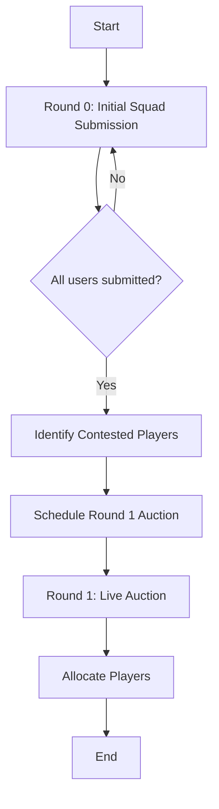

# Auction Management System

## Overview

The GullyGuru auction system follows a two-round process:
1. **Round 0 (Initial Squad Submission)**: Users submit their preferred squad of 18 players.
2. **Round 1 (Contested Players Auction)**: Live auction for players requested by multiple users.

This document outlines the implementation details for both rounds across different interfaces.



## Information Visibility

### Public Information (Group Chat)

Information visible to all users in group chats:

1. **Auction Announcements**
   - Current player being auctioned
   - Current highest bid and bidder
   - Auction timer status (e.g., "15 seconds remaining")
   - Timer extensions when bids are placed
   - Final auction results for each player

2. **Round 0 Status Updates**
   - Users who have submitted their squads
   - Submission deadline information
   - Time remaining for submissions

3. **Time Slot Voting**
   - Available time slots for auction
   - Current vote counts
   - Final selected time slot

### Private Information (Direct Messages)

Information visible only to individual users:

1. **Personal Auction Interactions**
   - Personalized bidding options based on budget
   - Bid confirmation messages
   - Budget warnings when approaching limits
   - Outbid notifications

2. **Squad Submission (Round 0)**
   - Complete squad selection interface
   - Budget validation results
   - Submission confirmation

3. **Budget Information**
   - Current budget status
   - Maximum possible bid calculations
   - Remaining budget after acquisitions

## Telegram UI

### Personal Chat Commands

#### Team and Auction Management
- [x] `/myteam` - View current team composition
  - Shows acquired players (both contested and uncontested)
  - Displays remaining budget
  - Indicates acquisition method for each player

- [x] `/submit_squad` - Submit initial squad of 18 players (Round 0)
  - Initiates an interactive process for selecting players
  - Validates total squad budget (≤ 100 Cr)
  - Confirms submission with user

- [x] `/bid <amount>` - Place a bid during active auction (Round 1)
  - Validates bid against minimum increment rules
  - Checks user budget availability
  - Provides feedback on bid status

- [x] `/auction_status` - Check current auction status
  - Shows current player being auctioned
  - Displays highest bid and bidder
  - Shows time remaining

#### Admin Commands
- [ ] `/start_round_zero` - Initiate Round 0 for squad submissions
  - Sets submission deadline
  - Announces start to all users
  
- [ ] `/suggest_time_slots` - Suggest time slots for Round 1 auction
  - Creates poll for users to vote on preferred times
  
- [ ] `/start_auction` - Start Round 1 auction at scheduled time
  - Confirms all users are online
  - Initiates auction process
  - Announces first contested player

- [ ] `/next_player` - Move to next player in auction
  - Completes current player auction
  - Announces winner
  - Displays next contested player

- [ ] `/complete_auction` - End the entire auction process
  - Finalizes all player allocations
  - Generates summary of results

### Group Chat Commands

#### Auction Commands
- [x] `/round_zero_status` - Check status of Round 0 submissions
  - Shows which users have submitted squads
  - Displays submission deadline
  - Shows time remaining

- [x] `/vote_time_slot` - Vote for preferred auction time
  - Displays available time slots
  - Records user's vote

- [x] `/time_slot_results` - View results of time slot voting
  - Shows votes for each time slot
  - Displays winning time slot

- [x] `/auction_status` - Check current auction status
  - Shows current player being auctioned
  - Displays highest bid and bidder
  - Shows time remaining

#### Admin Commands
- [ ] Same as personal chat admin commands, but with group-wide announcements

### Callback Handlers

#### Player Selection (Round 0)
- Paginated player list for selection
- Filters by team, role, or price
- Add/remove players from squad
- Display current squad composition and total price

#### Time Slot Voting
- Display time slots in user-friendly format
- Handle vote submission
- Prevent multiple votes from same user
- Update poll results

#### Quick Bidding (Round 1)
- Predefined bid increments based on current price
- One-tap bid submission
- Immediate feedback on bid status

### Notifications

#### Round 0 Notifications
- Round 0 start announcement
- Submission deadline reminders
- Submission confirmation

#### Round 1 Scheduling Notifications
- Time slot voting announcement
- Auction schedule announcement
- Pre-auction reminder (1 hour before)

#### Auction Notifications
- Auction start announcement
- Outbid notifications (private)
- Player auction completion
- Auction end summary

## User Interaction Patterns

### Conversation Handlers

The bot implements several conversation handlers to manage multi-step interactions:

1. **Squad Submission Flow**
   - Player selection interface
   - Budget validation
   - Confirmation

2. **Auction Bidding**
   - Bid amount selection/entry
   - Confirmation
   - Result notification

3. **Time Slot Voting**
   - Time slot selection
   - Vote confirmation
   - Results notification

### Keyboard Navigation

The bot uses a hierarchical keyboard navigation system:

1. **Player Selection**
   - Paginated player listings
   - Filters by team, role, price
   - Selected player indicators

2. **Bidding Interface**
   - Quick bid increments
   - Custom bid entry
   - Budget indicators

3. **Action Confirmations**
   - Explicit confirmation for bids
   - Cancel options to prevent accidental bids

## Privacy Considerations

### Data Protection

1. **Budget Information**
   - User budget is only visible to the user
   - Bid capacity is calculated privately
   - Remaining budget after acquisitions is private

2. **Strategic Information**
   - Bidding intentions are not revealed until confirmed
   - Squad composition during Round 0 is private until submission
   - Maximum bid calculations are private

### Transparency Balance

1. **Public Accountability**
   - All completed bids are publicly announced
   - Current highest bids are visible to maintain fairness
   - Final player allocations are public

2. **Private Decision-Making**
   - Users can evaluate bidding options privately
   - Budget management tools are provided confidentially
   - Outbid notifications are sent privately

## API System

### Core Components

The auction system is implemented through several API components:

1. **Auction Management**
   - Handles auction rounds and their states
   - Manages the transition between Round 0 and Round 1
   - Controls the auction flow and player selection

2. **Bidding System**
   - Processes bid placement and validation
   - Enforces bidding rules and constraints
   - Tracks highest bids and bidders

3. **Player Allocation**
   - Assigns players to users based on auction results
   - Handles uncontested player allocation
   - Updates user budgets after acquisitions

### Error Handling

The API provides standardized error responses for auction operations:

- 400: Bad Request (invalid bid amount, insufficient budget)
- 403: Forbidden (unauthorized bid attempt)
- 404: Not Found (auction or player not found)
- 409: Conflict (auction state conflict, outbid)
- 422: Unprocessable Entity (invalid squad composition)

Each error response includes:
- Error code
- Error message
- Optional details for debugging

### API Schemas

The auction API uses Pydantic models for request validation and response serialization:

#### Auction Schemas

```python
# Base model for auction rounds
class AuctionRoundBase(BaseModel):
    gully_id: int
    round_number: int
    timer_duration: int = 15
    
# Response model for auction round data
class AuctionRoundResponse(AuctionRoundBase):
    id: int
    status: str
    start_time: datetime
    end_time: Optional[datetime]
    timer_extensions: int
    current_player_id: Optional[int]
    current_player: Optional[PlayerResponse]
    highest_bid: Optional[Decimal]
    highest_bidder: Optional[str]
    time_remaining: Optional[int]
    
    class Config:
        from_attributes = True
```

#### Bid Schemas

```python
# Base model for auction bids
class AuctionBidBase(BaseModel):
    player_id: int
    bid_amount: Decimal
    
    @field_validator("bid_amount")
    @classmethod
    def validate_bid_amount(cls, v):
        return validate_non_negative(v)
    
# Response model for auction bid data
class AuctionBidResponse(AuctionBidBase):
    id: int
    user_id: int
    username: str
    auction_round_id: int
    gully_id: int
    status: str
    is_winning_bid: bool
    bid_timestamp: datetime
    player_name: str
    player_team: str
    player_type: str
    
    class Config:
        from_attributes = True
```

## API Endpoints

### Round 0 Management

#### Admin Endpoints
- `POST /api/auctions/start-round-zero`
  - Initiates Round 0 with submission deadline
  - Admin only access

#### User Endpoints
- `POST /api/auctions/submit-initial-squad`
  - Submit list of 18 player IDs
  - Validates budget constraints
  
- `GET /api/auctions/round-zero-status`
  - Retrieves current status of Round 0
  - Shows submitted and pending users

### Round 1 Scheduling

#### Admin Endpoints
- `POST /api/auctions/suggest-time-slots`
  - Create poll with suggested time slots
  - Admin only access
  
- `POST /api/auctions/start-round-one`
  - Schedule Round 1 auction
  - Admin only access

#### User Endpoints
- `POST /api/auctions/vote-time-slot`
  - Submit vote for preferred time slot
  
- `GET /api/auctions/time-slot-results`
  - Retrieve voting results
  
- `GET /api/auctions/contested-players`
  - Get list of contested players for auction

### Auction Bidding

#### Admin Endpoints
- `POST /api/auctions/complete-player`
  - Complete current player auction
  - Move to next player
  - Admin only access
  
- `POST /api/auctions/complete`
  - Complete entire auction
  - Admin only access

#### User Endpoints
- `POST /api/auctions/bids`
  - Place bid on current player
  
- `GET /api/auctions/current-status`
  - Get current auction status
  
- `GET /api/auctions/user-status`
  - Get user's current auction status

### Results & Information

- `GET /api/auctions/results`
  - Get complete auction results
  
- `GET /api/users/{user_id}/team`
  - Get user's team after auction

## Scheduled Tasks

The auction system includes background tasks for:

- Processing auction round transitions
- Handling timer expirations
- Allocating uncontested players
- Updating user budgets after auctions

## Python Services

### Round 0 Management

- `AuctionRoundZeroService`
  - `start_round_zero(gully_id, submission_deadline)` - Initiate Round 0
  - `submit_squad(user_id, gully_id, player_ids)` - Process squad submission
  - `validate_squad(player_ids)` - Validate squad composition and budget
  - `get_round_zero_status(gully_id)` - Get current Round 0 status
  - `identify_contested_players(gully_id)` - Identify players requested by multiple users

### Round 1 Scheduling

- `AuctionSchedulingService`
  - `suggest_time_slots(gully_id, time_slots)` - Create time slot poll
  - `vote_time_slot(user_id, gully_id, poll_id, selected_slot)` - Record user vote
  - `get_time_slot_results(gully_id, poll_id)` - Get voting results
  - `determine_winning_slot(gully_id, poll_id)` - Calculate winning time slot
  - `schedule_auction(gully_id, auction_time)` - Schedule Round 1 auction

### Bidding Logic

- `BiddingService`
  - `validate_bid(user_id, gully_id, player_id, bid_amount)` - Validate bid
  - `place_bid(user_id, gully_id, player_id, bid_amount)` - Process bid
  - `get_highest_bid(gully_id, player_id)` - Get current highest bid
  - `calculate_min_bid_increment(current_bid)` - Calculate minimum bid increment
  - `get_auction_status(gully_id)` - Get current auction status

### Player Allocation

- `PlayerAllocationService`
  - `allocate_uncontested_players(gully_id)` - Allocate uncontested players
  - `allocate_player_to_winner(gully_id, player_id)` - Allocate player to winning bidder
  - `update_user_budget(user_id, gully_id, amount)` - Update user's budget
  - `complete_player_auction(gully_id, player_id)` - Complete current player auction
  - `complete_auction(gully_id)` - Complete entire auction process

## Database Models

### Core Models

- `UserSquad`
  - `id`: Primary key
  - `user_id`: Foreign key to User
  - `gully_id`: Foreign key to Gully
  - `created_at`: Timestamp
  - `updated_at`: Timestamp
  - Relationships:
    - `user`: User who submitted the squad
    - `gully`: Gully the squad belongs to
    - `squad_players`: List of UserSquadPlayer

- `UserSquadPlayer`
  - `id`: Primary key
  - `user_squad_id`: Foreign key to UserSquad
  - `player_id`: Foreign key to Player
  - Relationships:
    - `user_squad`: UserSquad this player belongs to
    - `player`: Player reference

- `AuctionBid`
  - `id`: Primary key
  - `user_id`: Foreign key to User
  - `player_id`: Foreign key to Player
  - `gully_id`: Foreign key to Gully
  - `bid_amount`: Decimal
  - `is_winning_bid`: Boolean
  - `created_at`: Timestamp
  - Relationships:
    - `user`: User who placed the bid
    - `player`: Player being bid on
    - `gully`: Gully the bid belongs to

- `PlayerAuctionStatus`
  - `id`: Primary key
  - `player_id`: Foreign key to Player
  - `gully_id`: Foreign key to Gully
  - `status`: String (contested, uncontested, sold, unsold)
  - `base_price`: Decimal
  - `sold_price`: Decimal (nullable)
  - `sold_to_user_id`: Foreign key to User (nullable)
  - Relationships:
    - `player`: Player reference
    - `gully`: Gully reference
    - `sold_to_user`: User who acquired the player (if sold)

- `UserPlayer`
  - `id`: Primary key
  - `user_id`: Foreign key to User
  - `player_id`: Foreign key to Player
  - `gully_id`: Foreign key to Gully
  - `acquisition_type`: String (auction, uncontested)
  - `price`: Decimal
  - `created_at`: Timestamp
  - Relationships:
    - `user`: User who owns the player
    - `player`: Player reference
    - `gully`: Gully reference

### Supporting Models

- `AuctionTimeSlot`
  - `id`: Primary key
  - `gully_id`: Foreign key to Gully
  - `poll_id`: String
  - `slot_time`: DateTime
  - `created_at`: Timestamp
  - Relationships:
    - `gully`: Gully reference
    - `votes`: List of TimeSlotVote

- `TimeSlotVote`
  - `id`: Primary key
  - `user_id`: Foreign key to User
  - `time_slot_id`: Foreign key to AuctionTimeSlot
  - `created_at`: Timestamp
  - Relationships:
    - `user`: User who voted
    - `time_slot`: AuctionTimeSlot reference

## Database Schema

```
UserSquad(id, user_id, gully_id, created_at, updated_at)
UserSquadPlayer(id, user_squad_id, player_id)
AuctionBid(id, user_id, player_id, gully_id, bid_amount, is_winning_bid, created_at)
PlayerAuctionStatus(id, player_id, gully_id, status, base_price, sold_price, sold_to_user_id)
UserPlayer(id, user_id, player_id, gully_id, acquisition_type, price, created_at)
AuctionTimeSlot(id, gully_id, poll_id, slot_time, created_at)
TimeSlotVote(id, user_id, time_slot_id, created_at)
```

## Implementation Sequence

1. **Phase 1: Round 0 Implementation**
   - Database models for initial squad submission
   - API endpoints for Round 0
   - Bot commands for squad submission

2. **Phase 2: Round 1 Scheduling**
   - Time slot suggestion and voting system
   - Contested player identification
   - Auction scheduling

3. **Phase 3: Auction Implementation**
   - Bidding system
   - Player allocation
   - Auction status tracking

4. **Phase 4: Testing & Refinement**
   - Testing all components
   - User experience improvements
   - Documentation and deployment 