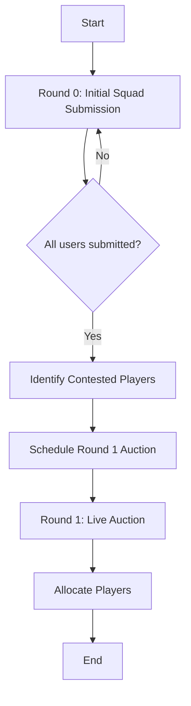

# Auction Management System

## Overview

The GullyGuru auction system follows a two-round process:
1. **Round 0 (Initial Squad Submission)**: Users submit their preferred squad of 18 players.
2. **Round 1 (Contested Players Auction)**: Live auction for players requested by multiple users.

This document outlines the essential implementation details for both rounds.

## Round 0: Initial Squad Submission Journey

Below is a detailed guide on how users submit their initial squad during Round 0, focusing on the user experience and UI flow.

### 1. Initiating Squad Submission

After a user has been registered in the system:

1. **Bot prompts**: The bot suggests the next step to the user in private chat:

Next step: Submit your initial squad (Round 0) with /submit_squad.

2. **User initiates**: The user types `/submit_squad` to start the squad selection process.

3. **Selection interface**: The bot presents an interactive interface for player selection:

To build your initial squad of 18 players, please select players from the list below:

[ Next ]  [ Filter Batsmen ]  [ Filter Bowlers ]

*(using inline keyboards for easier selection)*

### 2. Player Selection Process

1. **Browsing players**: Users can browse through paginated lists of players, with options to filter by:
   - Player type (Batsman, Bowler, All-rounder, Wicket-keeper)
   - Team
   - Price range

2. **Budget tracking**: As users select players, the bot shows:
   - Current squad composition
   - Total budget used
   - Remaining budget
   - Required player types to balance the squad

3. **Selection feedback**: When a player is selected, the bot confirms:

Added [Player Name] ([Player Type]) to your squad. Base price: [Price] Cr.
Squad: [X]/18 players | Budget used: [Y]/100 Cr.

### 3. Squad Validation and Submission

1. **Validation checks**: After selecting 18 players, the bot validates:
   - Total budget (must not exceed 100 Cr)
   - Squad balance (minimum requirements for each player type)
   - Player eligibility

2. **Confirmation request**: The bot presents the complete squad for confirmation:

Your selected squad is:
	1.	Player A (BAT) - 10.0 Cr
	2.	Player B (BOWL) - 8.5 Cr
…
	18.	Player R (WK) - 5.0 Cr

Total budget: 98.5 Cr
Confirm submission? [Yes] [No]

3. **Final submission**: Upon user confirmation, the bot:
   - Saves the squad to the database
   - Confirms to the user: "Squad submitted successfully!"
   - Posts a notification in the group chat: "@UserName has submitted their Round 0 squad. Good luck!"

### 4. Post-Submission Information

After submission, the user can:
1. View their submitted squad using `/myteam`
2. Check the status of all rounds including Round 0 submissions with `/auction_status` in the group chat
3. Wait for the Round 1 auction to begin for contested players

## Information Visibility

### Public Information (Group Chat)

Information visible to all users in group chats:

1. **Auction Announcements**
   - Current player being auctioned
   - Current highest bid and bidder
   - Auction timer status (e.g., "15 seconds remaining")
   - Timer extensions when bids are placed
   - Final auction results for each player

2. **Round 0 Status Updates**
   - Users who have submitted their squads
   - Submission deadline information
   - Time remaining for submissions

3. **Time Slot Voting**
   - Available time slots for auction
   - Current vote counts
   - Final selected time slot

### Private Information (Direct Messages)

Information visible only to individual users:

1. **Personal Auction Interactions**
   - Personalized bidding options based on budget
   - Bid confirmation messages
   - Budget warnings when approaching limits
   - Outbid notifications

2. **Squad Submission (Round 0)**
   - Complete squad selection interface
   - Budget validation results
   - Submission confirmation

3. **Budget Information**
   - Current budget status
   - Maximum possible bid calculations
   - Remaining budget after acquisitions

## Telegram UI

### Personal Chat Commands

#### Team and Auction Management
- [x] `/myteam` - View current team composition
  - Shows acquired players (both contested and uncontested)
  - Displays remaining budget
  - Indicates acquisition method for each player

- [x] `/submit_squad` - Submit initial squad of 18 players (Round 0)
  - Initiates an interactive process for selecting players
  - Validates total squad budget (≤ 100 Cr)
  - Confirms submission with user

- [x] `/bid <amount>` - Place a bid during active auction (Round 1)
  - Validates bid against minimum increment rules
  - Checks user budget availability
  - Provides feedback on bid status

- [x] `/auction_status` - Check current auction status
  - Shows current player being auctioned
  - Displays highest bid and bidder
  - Shows time remaining

#### Admin Commands
- [x] `/admin_panel` - Access auction-related admin functionality
  - Shows auction-specific admin options:
    - Start Round 0 or Round 1
    - End an auction round
    - Move to next player in auction
    - End the entire auction process

### Group Chat Commands

#### Auction Commands
- [x] `/auction_status` - Check auction status for all rounds
  - Round 0: Initial Squad Submission
    - Shows which users have submitted squads
    - Displays submission deadline
    - Shows time remaining
  - Round 1: Players with User Conflict
    - Shows status of contested players auction
  - Round 2: User Requested Players
    - Shows status of requested players auction
  - Current Active Auction
    - Shows current player being auctioned
    - Displays highest bid and bidder
    - Shows time remaining

## User Interaction Patterns

### Bidding Interface

The bot provides an intuitive bidding interface during Round 1:

1. **Quick Bid Buttons**
   - Predefined bid increments based on current price
   - One-tap bid submission
   - Immediate feedback on bid status

2. **Custom Bid Entry**
   - Option to enter custom bid amount
   - Validation against minimum bid rules
   - Budget availability check

### Squad Selection Interface

For Round 0 squad submission, the bot provides:

1. **Player Selection**
   - Paginated player listings
   - Filters by team, role, price
   - Selected player indicators

2. **Budget Management**
   - Real-time budget calculation
   - Warning when approaching limit
   - Validation before submission

## Future Implementation

The following features are planned for future implementation:

### Additional Admin Commands
- `/start_round_zero` - Initiate Round 0 for squad submissions
- `/suggest_time_slots` - Suggest time slots for Round 1 auction
- `/start_auction` - Start Round 1 auction at scheduled time
- `/next_player` - Move to next player in auction
- `/complete_auction` - End the entire auction process

### Enhanced Conversation Handlers
- Squad Submission Flow
- Auction Bidding
- Time Slot Voting

### Advanced Keyboard Navigation
- Player Selection
- Bidding Interface
- Action Confirmations

### Privacy Considerations
- Data Protection
- Transparency Balance

### API System
- Core Components
- Bidding System
- Player Allocation
- Error Handling
- API Schemas
- API Endpoints

### Scheduled Tasks
- Processing auction round transitions
- Handling timer expirations
- Allocating uncontested players
- Updating user budgets after auctions

### Python Services
- Round 0 Management
- Round 1 Scheduling
- Bidding Logic
- Player Allocation

### Database Models
- Core Models
- Supporting Models
- Database Schema 