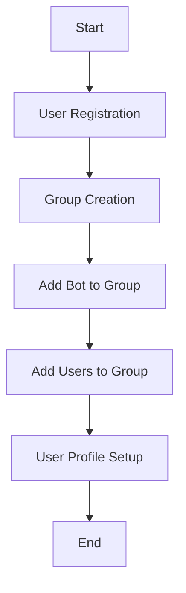

# User Management System

## Overview

The GullyGuru user management system handles user registration, authentication, and basic profile management. This document outlines the essential implementation details.

## User Journey: Onboarding and Initial Squad Submission

Below is a **step-by-step** guide detailing how a **new user** is onboarded into the Telegram group, initiates a **private chat** with the bot, and submits their **initial squad** (Round 0). It also includes how the **Telegram UI** supports this flow.

### 1. Admin Adds a User to the Group

1. **Admin action**: The group admin opens the Telegram group settings and adds the new user to the group.  
2. **Bot triggers welcome**: The bot detects the newly added user and immediately posts a welcome message in the group chat, mentioning (tagging) that user.

**Example** (in the group chat):

Welcome @NewUser!
Please start a private conversation with me (the GullyGuru Bot) to continue your registration and submit your initial squad.

- This message includes instructions or a *deep link* that takes the user directly to a **private chat** with the bot.

### 2. User Starts Private Chat with the Bot

1. **User taps link**: The user clicks or taps the deep link (or manually opens the bot via Telegram search).  
2. **User sees /start**: The bot's slash-command menu suggests `/start` (or the user simply types `/start`).  
3. **Bot prompts name**: The bot greets the user privately:

Hello! I don't have your details yet. Please share your name or preferred nickname:

4. **User replies with name**: The user enters their name.  
5. **Bot registers user**: The bot creates a player record in the database (if it doesn't already exist) and confirms:

Thank you, [UserName]! You are now registered as a player.

### 3. Prompt to Submit Initial Squad

After the **name** has been saved:

1. **Bot checks if user has a squad**: If the user has **not** submitted a squad, the bot suggests:

Next step: Submit your initial squad (Round 0) with /submit_squad.

2. **User types `/submit_squad`**: The user initiates the squad selection flow.  

Depending on your design, this flow can be:

- **Slash Command Only**: The user types `/submit_squad` and then follows text prompts.  
- **Inline Keyboards**: The user sees an inline keyboard listing players or player categories and selects 18 players step by step.

**Example** (bot message in private chat):

To build your initial squad of 18 players, please select players from the list below:

[ Next ]  [ Filter Batsmen ]  [ Filter Bowlers ]

*(using inline keyboards, for example)*

### 4. User Finalizes Squad

1. **Bot validates**: After the user picks 18 players, the bot checks for any constraints (e.g. budget, positions, etc.).  
2. **Confirmation**: The bot asks:

Your selected squad is:
	1.	Player A
	2.	Player B
…
	3.	Player R

Confirm submission? (Yes/No)

*(This might be inline button: [Yes] [No])*  
3. **User Confirms**: If the user chooses **Yes**, the bot finalizes the squad:

Squad submitted successfully!

### 5. Group Chat Notification

- **On successful squad submission**, the bot posts a confirmation in the group chat.  
- Example:

@NewUser has submitted their Round 0 squad. Good luck!

- This public notice helps **admins** and other **group members** track the progress of Round 0 submissions.

### 6. Summary of Key Telegram UI Elements

1. **Group Welcome Message**  
 - When a user is added, the bot automatically welcomes them in the group and instructs them to open a **private** conversation.

2. **Deep Linking**  
 - The welcome message can include a clickable **t.me/bot_username** link for quick access to the bot's private chat.

3. **Slash Command Menus**  
 - In private chat, the user sees `/start` and eventually `/submit_squad` as possible commands.  
 - These appear in Telegram's "type `/` to see commands" menu if configured correctly with BotFather scopes.

4. **Inline Keyboards** (optional for squad selection)  
 - Offer a faster, more guided selection process with interactive buttons.  
 - Eliminates the need for manually typing each player's name or an ID.

5. **Group Notification**  
 - The final step ensures social proof and progress tracking in the group.  
 - Shows which users have finished their registration (submitted squads).

### 7. User Experience Flow in Brief

1. **Admin adds user** → Bot welcomes user in group.  
2. **User taps link** → Private chat opens with the bot.  
3. **User /start** → Bot asks for name, registers them.  
4. **Bot** → *"Next step: use /submit_squad."*  
5. **User /submit_squad** → Chooses 18 players, confirms.  
6. **Bot** → *"Squad submitted, well done!"*  
7. **Group** → *"@NewUser just submitted their Round 0 squad."*

This flow ensures a **seamless** experience from group addition to private chat to final submission, with clear public feedback in the group at the end.

## Game Terminology and Concepts

### What is a Gully?

In GullyGuru, a "gully" represents a cricket community group or league. The term comes from "gully cricket," a form of street cricket played in the Indian subcontinent. Key characteristics of a gully include:

1. **Community Structure**
   - A gully is a self-contained community with its own members, admins, and teams
   - Each gully can have its own rules, scoring systems, and competition formats

2. **Organizational Unit**
   - Gullies serve as the primary organizational unit within the system
   - All game activities, teams, and competitions exist within the context of a specific gully

3. **Telegram Integration**
   - Each gully is typically linked to a Telegram group for community interaction
   - The bot provides both group-wide and private command interfaces
   - Admins manage the gully through a combination of group and private commands

### Common Terminology

1. **Teams**
   - Groups of users within a gully who compete together
   - Teams have captains who manage team composition and strategy
   - Users can belong to only one team per gully

2. **Seasons**
   - Time-bounded competition periods within a gully
   - Seasons have defined start and end dates
   - Statistics and rankings reset between seasons

3. **Matches**
   - Individual cricket matches between teams
   - Matches have specific formats, teams, and scoring rules
   - Results contribute to season standings

4. **Predictions**
   - User forecasts about match outcomes
   - Predictions earn points based on accuracy
   - Prediction points contribute to individual and team rankings

## Information Visibility

### Public Information (Group Chat)

Information visible to all users in group chats:

1. **Group Management**
   - Group creation announcements
   - User join/leave notifications
   - Gully linking confirmations

2. **Administrative Announcements**
   - Season start/end notifications
   - Rule changes
   - Special events

3. **Gully Information**
   - Gully details and status
   - Participant list (without sensitive details)

### Private Information (Direct Messages)

Information visible only to individual users:

1. **Personal Profile**
   - Complete profile details
   - Authentication information
   - Gully participation details

2. **Admin Controls**
   - Auction management options (for admins)

## Group Setup Process

### 1. Create Telegram Group
- User creates a new Telegram group
- User adds GullyGuru bot to the group
- Bot automatically assigns admin role to the user who added it

### 2. Link Group to Gully
- Admin uses `/create_gully` command in the group
- Bot guides admin through gully creation process
- Bot automatically links the group to the newly created gully

### 3. Add Users to Group
- Admin adds users to the Telegram group
- Users are automatically added to the gully
- Bot confirms successful joining

## Telegram UI

### Telegram Command Types and Rationale

Below is a concise list of the essential commands for the bot, which **Telegram UI** format they use, and **why** each approach is recommended.

#### 1. Private Chat Commands

| Command           | Type of UI | Purpose & Reason                                                                                              |
|-------------------|------------|----------------------------------------------------------------------------------------------------------------|
| `/game_guide`     | Slash      | A single entry point for tutorials, rules, and game info. A slash command ensures it's quickly discoverable.   |
| `/myteam`         | Slash      | Lets users quickly see their current team. A slash command keeps it simple and is used often, so easy access. |
| `/submit_squad`   | Slash      | Initiates the Round 0 squad submission. The clear slash command is easy to remember and start.                |
| `/bid <amount>`   | Slash      | Places a bid during an active auction. A slash command with an argument is intuitive for quick usage.         |
| `/auction_status` | Slash      | Displays auction info on demand. Having it as a slash command prevents clutter and is easy to call at any time. |

**Why Slash in Private Chat?**  
- Users can discover commands by typing `/`.  
- Clear, one-step commands are best for direct, personal interactions.

#### 2. Group Chat Commands

| Command              | Type of UI | Purpose & Reason                                                                                       |
|----------------------|------------|---------------------------------------------------------------------------------------------------------|
| `/auction_status`    | Slash      | Shows status of all auction rounds (Round 0: Initial Squad Submission, Round 1: Players with User Conflict, Round 2: User Requested Players). Accessible to everyone in the group.        |

**Why Slash in Group Chats?**  
- Group context often requires quick queries/announcements.  
- Users are accustomed to typing `/` in groups to find relevant commands.

#### 3. Admin-Only Commands

| Command         | Type of UI | Purpose & Reason                                                                               |
|-----------------|------------|-------------------------------------------------------------------------------------------------|
| `/admin_panel`  | Slash      | A single menu for controlling auctions (start/stop auctions, next player, etc.).               |

**Why an Admin Slash Command?**  
- Visible only to **chat administrators** when properly scoped.  
- Keeps general users from seeing irrelevant or sensitive admin commands.  
- Centralizes advanced functions without cluttering the main command list.

#### 4. Inline Keyboards (Optional Complement)

For **multi-step or more complex interactions** (e.g., selecting players from a long list, confirming final choices, or voting with multiple time slots), inline keyboards are useful to:

- Guide the user step-by-step in a single conversation flow.  
- Avoid overloading with multiple slash commands.  
- Provide immediate, one-tap options for each decision point.

Inline keyboards **don't appear** in the slash-command menu; they are **embedded** with bot messages. This helps keep the slash menu minimal while still offering rich interactivity when needed.

#### Summary

- **Slash Commands** are quick to type/discover via the `"/"` menu and are ideal for simple triggers in both private and group chats.  
- **Inline Keyboards** (used inside messages) excel for guided, multi-step flows.  
- **Command Scopes** (set via [BotFather](https://t.me/BotFather)) ensure the right commands appear only in private chats, group chats, or for admins.

By using **slash commands** for essential tasks and **inline keyboards** for complex flows, we create a **clean, intuitive** user experience that matches Telegram's native design.

### Personal Chat Commands

#### Core User Commands
- [x] `/game_guide` - Learn about the game and terminology
  - Explains what a "gully" is (a cricket community group)
  - Clarifies game-specific terminology and concepts
  - Provides overview of game mechanics and participation
  - Shows examples of how to interact with the bot
  - Consolidates all help and game concept explanations

#### Admin Commands
- [x] `/admin_panel` - Access auction-related admin functionality
  - Shows auction-specific admin options:
    - Start Round 0 or Round 1
    - End an auction round
    - Move to next player in auction
    - End the entire auction process

### Group Chat Commands

All admin actions related to auctions—starting, ending, or controlling rounds—are performed within `/admin_panel` in private chat.

## Automatic Onboarding

Users are automatically added to the gully upon being added to the Telegram group. No `/join_gully` command is needed.

## Future Implementation

The following features are planned for future implementation:

### Additional Personal Chat Commands
- `/my_gullies` - View all gullies user is participating in
- `/switch_gully` - Switch active gully context

### Enhanced Group Setup and Admin Workflow
- Streamlined Group Creation Process
- Admin Dashboard
- Admin and User Navigation
- Admin Handoff Protocol

### Enhanced Gully Switching and Team Management
- Intuitive UI for Gully Navigation
- Team Submission and Information Flow
- Information Hierarchy
- Cross-Gully Intelligence

### User Interaction Patterns
- Conversation Handlers
- Keyboard Navigation

### Privacy Considerations
- Data Protection
- Transparency Balance

### API System
- Core Components
- Authentication
- Error Handling
- API Schemas
- API Endpoints

### Scheduled Tasks
- Token cleanup
- User data synchronization
- Role change processing
- Scheduled notifications

### Python Services
- User Management
- Authentication
- Gully Management
- Group Management

### Database Models
- Core Models
- Supporting Models

### Implementation Sequence
- Phase 1: User Registration & Authentication
- Phase 2: Group & Gully Setup
- Phase 3: User Profile Management
- Phase 4: Testing & Refinement 