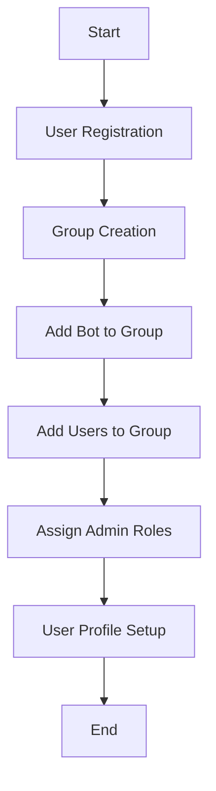

# User Management System

## Overview

The GullyGuru user management system handles user registration, authentication, profile management, and group setup. This document outlines the implementation details across different interfaces.



## Game Terminology and Concepts

### What is a Gully?

In GullyGuru, a "gully" represents a cricket community group or league. The term comes from "gully cricket," a form of street cricket played in the Indian subcontinent. Key characteristics of a gully include:

1. **Community Structure**
   - A gully is a self-contained community with its own members, admins, and teams
   - Each gully can have its own rules, scoring systems, and competition formats
   - Multiple gullies can exist independently, allowing users to participate in different communities

2. **Organizational Unit**
   - Gullies serve as the primary organizational unit within the system
   - All game activities, teams, and competitions exist within the context of a specific gully
   - Users can belong to multiple gullies simultaneously but interact with one at a time

3. **Telegram Integration**
   - Each gully is typically linked to a Telegram group for community interaction
   - The bot provides both group-wide and private command interfaces
   - Admins manage the gully through a combination of group and private commands

### Common Terminology

1. **Teams**
   - Groups of users within a gully who compete together
   - Teams have captains who manage team composition and strategy
   - Users can belong to only one team per gully

2. **Seasons**
   - Time-bounded competition periods within a gully
   - Seasons have defined start and end dates
   - Statistics and rankings reset between seasons

3. **Matches**
   - Individual cricket matches between teams
   - Matches have specific formats, teams, and scoring rules
   - Results contribute to season standings

4. **Predictions**
   - User forecasts about match outcomes
   - Predictions earn points based on accuracy
   - Prediction points contribute to individual and team rankings

## Information Visibility

### Public Information (Group Chat)

Information visible to all users in group chats:

1. **Group Management**
   - Group creation announcements
   - User join/leave notifications
   - Admin role assignments
   - Gully linking confirmations

2. **Administrative Announcements**
   - Season start/end notifications
   - Rule changes
   - Special events

3. **Gully Information**
   - Gully details and status
   - Participant list (without sensitive details)
   - Gully configuration changes

### Private Information (Direct Messages)

Information visible only to individual users:

1. **Personal Profile**
   - Complete profile details
   - Authentication information
   - Gully participation details
   - Role assignments

2. **Admin Controls**
   - User management options (for admins)
   - Gully configuration settings
   - System management tools

3. **Navigation Context**
   - Current active gully
   - Available gullies for switching
   - Personal role in each gully

## Group Setup Process

### 1. Create Telegram Group
- User creates a new Telegram group
- User adds GullyGuru bot to the group
- Bot automatically assigns admin role to the user who added it

### 2. Link Group to Gully
- Admin uses `/create_gully` command in the group
- Bot guides admin through gully creation process
- Bot automatically links the group to the newly created gully

### 3. Add Users to Group
- Admin adds users to the Telegram group
- Users join the gully using `/join_gully` command
- Bot confirms successful joining

### 4. Assign Roles
- Admin assigns additional admins using `/add_admin` command
- Bot confirms role assignments
- Admin configures gully settings

## Enhanced Group Setup and Admin Workflow

### Streamlined Group Creation Process

The GullyGuru system provides a streamlined workflow for creating and managing Telegram groups and gullies:

1. **Initial Bot Interaction**
   - User starts a private chat with the GullyGuru bot
   - User completes basic registration with `/start` command
   - Bot provides guidance on creating a new gully

2. **One-Click Group Creation**
   - User selects "Create New Gully" from the private chat menu
   - Bot offers two options:
     - Create a new Telegram group automatically
     - Link to an existing Telegram group
   - For automatic creation, bot creates the group and adds the user as admin
   - For existing groups, bot generates a unique invite link to be added

3. **Guided Setup Process**
   - Once the bot is in the group, it initiates a guided setup wizard
   - Step-by-step configuration with inline buttons for easy navigation
   - Visual progress indicators show completion status
   - Setup can be paused and resumed at any point

4. **Admin Dashboard**
   - After setup, admins access a comprehensive dashboard via `/admin_panel`
   - Dashboard provides quick access to all admin functions
   - Real-time metrics and status information
   - Actionable alerts for required admin attention

### Admin and User Navigation

The system provides clear navigation paths between personal and group spaces:

1. **Context-Aware Command Interface**
   - Commands automatically adapt based on chat context (group vs. private)
   - Bot provides guidance on which commands work in which context
   - Quick-access buttons for switching between contexts

2. **Private-to-Group Navigation**
   - From private chat, users can quickly access their groups
   - "My Groups" menu shows all groups with active status
   - One-tap navigation to switch Telegram to the selected group

3. **Group-to-Private Navigation**
   - In group chats, certain commands automatically redirect to private chat
   - Bot sends private message with deep link to continue the interaction
   - After private interaction, bot confirms completion in the group

4. **Admin Handoff Protocol**
   - Structured process for transferring admin responsibilities
   - Current admin nominates new admin via `/nominate_admin` command
   - Nominee receives confirmation request in private chat
   - Upon acceptance, permissions are automatically transferred
   - Group receives notification of admin change

## Telegram UI

### Personal Chat Commands

#### Core User Commands
- [x] `/start` - Register with the bot
  - Initiates user registration process
  - Collects basic user information
  - Creates user profile in database
  
- [x] `/help` - Get help with bot commands and game concepts
  - Displays available commands with descriptions
  - Provides navigation guidance for bot interaction
  - Offers contextual help based on user's current state

- [x] `/game_guide` - Learn about the game and terminology
  - Explains what a "gully" is (a cricket community group)
  - Clarifies game-specific terminology and concepts
  - Provides overview of game mechanics and participation
  - Shows examples of how to interact with the bot

- [x] `/profile` - View and edit profile
  - Displays current profile information
  - Allows editing of profile details
  - Shows participation in different gullies

#### Gully Management Commands  
- [x] `/my_gullies` - View all gullies user is participating in
  - Lists all gullies with basic information
  - Shows user's role in each gully
  - Provides option to switch between gullies

- [x] `/switch_gully <gully_id>` - Switch active gully context
  - Changes user's current active gully
  - Updates command context for subsequent commands
  - Confirms the switch with visual feedback
  - Shows quick summary of the selected gully

- [ ] `/notifications` - Manage notification preferences
  - View current notification settings
  - Toggle different notification types
  - Set quiet hours and frequency preferences

#### Admin Commands
- [ ] `/admin_panel` - Access admin functionality
  - Shows admin-specific options
  - Provides access to user management
  - Displays gully management options

- [ ] `/create_gully` - Create a new gully
  - Initiates gully creation process
  - Collects gully information
  - Sets up initial gully configuration

- [ ] `/setup_wizard` - Launch or resume the gully setup wizard
  - Guides through complete gully configuration
  - Provides visual progress tracking
  - Allows skipping or revisiting steps

- [ ] `/invite_link` - Generate a custom invite link for the group
  - Creates Telegram invite with custom parameters
  - Optionally sets expiration time
  - Tracks invite usage statistics

- [ ] `/bulk_add` - Facilitate adding multiple users at once
  - Accepts list of usernames or phone numbers
  - Sends batch invitations
  - Reports success/failure for each invitation

- [ ] `/admin_roles` - Manage granular admin permissions
  - View current admin role assignments
  - Create custom role configurations
  - Assign specific permissions to different admins

### Group Chat Commands

#### Core Group Commands
- [x] `/help_group` - Get help with group-specific commands
  - Explains the difference between personal and group commands
  - Shows how to navigate between group and personal bot spaces
  - Provides guidance on common group interactions

- [x] `/gully_info` - View information about the current gully
  - Displays gully details
  - Shows participant list
  - Provides gully status information

- [x] `/join_gully` - Join the gully associated with the group
  - Registers user in the current gully
  - Adds user to participant list
  - Confirms successful joining

- [x] `/leave_gully` - Leave the current gully
  - Removes user from gully
  - Confirms successful departure
  - Updates participant list

#### Team Commands
- [x] `/team_info` - View information about teams in the gully
  - Lists all teams in the current gully
  - Shows team standings and statistics
  - Provides options to join available teams

#### Admin Commands
- [ ] `/add_admin <username>` - Assign admin role to a user
  - Validates current user has admin privileges
  - Assigns admin role to specified user
  - Confirms role assignment

- [ ] `/remove_admin <username>` - Remove admin role from a user
  - Validates current user has admin privileges
  - Removes admin role from specified user
  - Confirms role removal

- [ ] `/gully_settings` - Configure gully settings
  - Displays current gully configuration
  - Allows modification of settings
  - Updates gully configuration

- [ ] `/nominate_admin <username>` - Nominate a new admin
  - Initiates admin transfer process
  - Sends confirmation request to nominee
  - Handles permission transfer upon acceptance

### Team Management Commands

- [ ] `/create_team` - Create a new team in the current gully
  - Guides through team setup process
  - Collects team name, description, and logo
  - Sets initial team settings and captain

- [ ] `/join_team <team_id>` - Request to join a specific team
  - Sends request to team captain
  - Shows team information and requirements
  - Provides status updates on request

- [ ] `/team_dashboard` - View comprehensive team information
  - Shows team composition and statistics
  - Displays upcoming matches and requirements
  - Provides team-specific announcements
  - Shows personal contribution to team

- [ ] `/switch_team` - Change teams within a gully
  - Shows available teams with joining options
  - Handles leaving current team gracefully
  - Manages transfer of user statistics

## Enhanced Gully Switching and Team Management

### Intuitive UI for Gully Navigation

The system provides a rich, intuitive UI for navigating between gullies:

1. **Visual Gully Selector**
   - Card-based interface showing all user's gullies
   - Each card displays:
     - Gully name and logo
     - Member count and active status
     - User's role in the gully
     - Last activity timestamp
   - Active gully is visually highlighted
   - Quick-action buttons for common tasks

2. **Context Persistence**
   - System maintains awareness of user's active gully
   - Commands automatically operate in active gully context
   - Visual indicators always show current context
   - Confirmation prompts for context-changing actions

3. **Gully Dashboard**
   - After selecting a gully, user sees comprehensive dashboard
   - Dashboard sections include:
     - Activity feed with recent events
     - Team standings and statistics
     - Upcoming matches and predictions
     - Personal performance metrics
   - Quick-access buttons for common actions

### Team Submission and Information Flow

The system ensures clear information flow for team-related activities:

1. **Team Submission Interface**
   - Structured forms for team-related submissions
   - Step-by-step guidance for complex submissions
   - Real-time validation with helpful error messages
   - Preview functionality before final submission

2. **Confirmation and Feedback Loop**
   - All submissions generate explicit confirmations
   - Important submissions require verification steps
   - System provides status updates for processing submissions
   - Notifications when submissions affect team status

3. **Information Hierarchy**
   - Information is organized in a clear hierarchy:
     - Critical updates as push notifications
     - Important information in summary views
     - Details available on demand
     - Historical data in searchable archives
   - Users can customize information density and frequency

4. **Cross-Gully Intelligence**
   - Smart suggestions based on activity across gullies
   - Unified notification center for all gullies
   - Ability to apply settings across multiple gullies
   - Comparative performance metrics across gullies

## User Interaction Patterns

### Conversation Handlers

The bot implements several conversation handlers to manage multi-step interactions:

1. **Registration Flow**
   - Username selection
   - Team name selection
   - Confirmation

2. **Gully Creation**
   - Name and description entry
   - Configuration settings
   - Confirmation

3. **Profile Editing**
   - Field selection
   - New value entry
   - Confirmation

### Keyboard Navigation

The bot uses a hierarchical keyboard navigation system:

1. **Main Menu**
   - Profile management
   - Gully navigation
   - Settings access

2. **Contextual Submenus**
   - Dynamic options based on current state
   - Back navigation to parent menus
   - Quick actions for common tasks

3. **Action Confirmations**
   - Explicit confirmation for irreversible actions
   - Cancel options to prevent accidental actions

## Privacy Considerations

### Data Protection

1. **User Information**
   - Personal details are only visible to the user and admins
   - Authentication tokens are securely stored
   - Private messages are not logged in group contexts

2. **Role-Based Access**
   - Admin-only features are properly restricted
   - User permissions are validated for each action
   - Group-specific roles are enforced

### Transparency Balance

1. **Public Group Actions**
   - Group-wide announcements for important events
   - Visible role assignments for accountability
   - Public confirmation of administrative actions

2. **Private User Management**
   - Personal settings managed in private chats
   - Sensitive information handled in direct messages
   - Profile details protected from unauthorized access

## API System

### Core Components

The user management system is implemented through several API components:

1. **User Management**
   - Handles user registration and profile management
   - Manages user authentication and session tracking
   - Controls user preferences and settings

2. **Group Management**
   - Processes Telegram group registration and configuration
   - Manages group-to-gully linking
   - Tracks group membership and roles

3. **Gully Management**
   - Handles gully creation and configuration
   - Manages gully membership and roles
   - Controls gully-specific settings

### Authentication

The API uses JWT (JSON Web Tokens) for authentication:

1. User registers via Telegram bot
2. API creates user record and generates a JWT token
3. Subsequent API requests include the token in the Authorization header
4. API validates the token and identifies the user

### Error Handling

The API provides standardized error responses for user management operations:

- 400: Bad Request (invalid input data)
- 401: Unauthorized (authentication required)
- 403: Forbidden (insufficient permissions)
- 404: Not Found (user, group, or gully not found)
- 409: Conflict (username already exists, already in gully)
- 422: Unprocessable Entity (invalid data format)

Each error response includes:
- Error code
- Error message
- Optional details for debugging

### API Schemas

The user management API uses Pydantic models for request validation and response serialization:

#### User Schemas

```python
# Base model with common user fields
class UserBase(BaseModel):
    username: str
    first_name: str
    last_name: Optional[str] = None

# Create model for registration
class UserCreate(UserBase):
    telegram_id: int

# Response model with additional fields
class UserResponse(UserBase):
    id: int
    telegram_id: int
    active_gully_id: Optional[int]
    created_at: datetime
    updated_at: datetime
    
    class Config:
        from_attributes = True
```

#### Gully Schemas

```python
# Base model for gully data
class GullyBase(BaseModel):
    name: str
    description: str

# Create model for new gullies
class GullyCreate(GullyBase):
    pass

# Response model with additional fields
class GullyResponse(GullyBase):
    id: int
    creator_id: int
    created_at: datetime
    updated_at: datetime
    is_active: bool
    
    class Config:
        from_attributes = True
```

## API Endpoints

### User Management

#### Public Endpoints
- `POST /api/users/register`
  - Register new user
  - Create user profile
  
- `POST /api/users/login`
  - Authenticate user
  - Generate access token

#### User Endpoints
- `GET /api/users/me`
  - Retrieve current user profile
  
- `PUT /api/users/me`
  - Update user profile
  
- `GET /api/users/me/gullies`
  - List user's gullies
  
- `PUT /api/users/me/active-gully`
  - Update active gully context

#### Admin Endpoints
- `GET /api/users`
  - List all users (with filtering)
  - Admin only access
  
- `GET /api/users/{user_id}`
  - Get specific user details
  - Admin only access
  
- `PUT /api/users/{user_id}/role`
  - Update user role
  - Admin only access

### Gully Management

#### Admin Endpoints
- `POST /api/gullies`
  - Create new gully
  - Admin only access
  
- `PUT /api/gullies/{gully_id}`
  - Update gully settings
  - Admin only access
  
- `DELETE /api/gullies/{gully_id}`
  - Delete gully
  - Admin only access

#### User Endpoints
- `GET /api/gullies`
  - List available gullies
  
- `GET /api/gullies/{gully_id}`
  - Get gully details
  
- `POST /api/gullies/{gully_id}/join`
  - Join gully
  
- `POST /api/gullies/{gully_id}/leave`
  - Leave gully

### Group Management

#### Admin Endpoints
- `POST /api/groups`
  - Register Telegram group
  - Admin only access
  
- `PUT /api/groups/{group_id}`
  - Update group settings
  - Admin only access
  
- `POST /api/groups/{group_id}/link-gully`
  - Link group to gully
  - Admin only access

#### User Endpoints
- `GET /api/groups/{group_id}`
  - Get group information
  
- `GET /api/groups/{group_id}/members`
  - List group members

## Scheduled Tasks

The user management system includes background tasks for:

- Cleaning up expired authentication tokens
- Synchronizing user data with Telegram
- Processing role changes and permissions
- Sending scheduled notifications

## Python Services

### User Management

- `UserService`
  - `register_user(telegram_id, username, first_name, last_name)` - Register new user
  - `get_user_profile(user_id)` - Get user profile
  - `update_user_profile(user_id, profile_data)` - Update user profile
  - `get_user_gullies(user_id)` - Get user's gullies
  - `set_active_gully(user_id, gully_id)` - Set user's active gully

### Authentication

- `AuthService`
  - `authenticate_user(telegram_id)` - Authenticate user via Telegram
  - `generate_token(user_id)` - Generate access token
  - `validate_token(token)` - Validate access token
  - `check_admin_permission(user_id, gully_id)` - Check if user has admin permissions

### Gully Management

- `GullyService`
  - `create_gully(name, description, creator_id)` - Create new gully
  - `update_gully(gully_id, gully_data)` - Update gully settings
  - `delete_gully(gully_id)` - Delete gully
  - `get_gully(gully_id)` - Get gully details
  - `list_gullies(filters)` - List gullies with filtering
  - `join_gully(user_id, gully_id)` - Add user to gully
  - `leave_gully(user_id, gully_id)` - Remove user from gully

### Group Management

- `GroupService`
  - `register_group(telegram_group_id, creator_id)` - Register Telegram group
  - `link_group_to_gully(group_id, gully_id)` - Link group to gully
  - `get_group_info(group_id)` - Get group information
  - `list_group_members(group_id)` - List group members
  - `add_admin(group_id, user_id)` - Add admin to group
  - `remove_admin(group_id, user_id)` - Remove admin from group

## Database Models

### Core Models

- `User`
  - `id`: Primary key
  - `telegram_id`: Integer
  - `username`: String
  - `first_name`: String
  - `last_name`: String (nullable)
  - `created_at`: Timestamp
  - `updated_at`: Timestamp
  - `active_gully_id`: Foreign key to Gully (nullable)
  - Relationships:
    - `gully_memberships`: List of GullyMember
    - `active_gully`: Gully reference
    - `group_memberships`: List of GroupMember

- `Gully`
  - `id`: Primary key
  - `name`: String
  - `description`: String
  - `creator_id`: Foreign key to User
  - `created_at`: Timestamp
  - `updated_at`: Timestamp
  - `is_active`: Boolean
  - Relationships:
    - `creator`: User reference
    - `members`: List of GullyMember
    - `linked_groups`: List of Group

- `GullyMember`
  - `id`: Primary key
  - `user_id`: Foreign key to User
  - `gully_id`: Foreign key to Gully
  - `role`: String (admin, member)
  - `joined_at`: Timestamp
  - Relationships:
    - `user`: User reference
    - `gully`: Gully reference

- `Group`
  - `id`: Primary key
  - `telegram_group_id`: Integer
  - `name`: String
  - `gully_id`: Foreign key to Gully (nullable)
  - `created_at`: Timestamp
  - `updated_at`: Timestamp
  - Relationships:
    - `gully`: Gully reference
    - `members`: List of GroupMember

- `GroupMember`
  - `id`: Primary key
  - `user_id`: Foreign key to User
  - `group_id`: Foreign key to Group
  - `role`: String (admin, member)
  - `joined_at`: Timestamp
  - Relationships:
    - `user`: User reference
    - `group`: Group reference

### Supporting Models

- `UserProfile`
  - `id`: Primary key
  - `user_id`: Foreign key to User
  - `display_name`: String (nullable)
  - `bio`: String (nullable)
  - `notification_preferences`: JSON
  - `created_at`: Timestamp
  - `updated_at`: Timestamp
  - Relationships:
    - `user`: User reference

- `UserSession`
  - `id`: Primary key
  - `user_id`: Foreign key to User
  - `token`: String
  - `created_at`: Timestamp
  - `expires_at`: Timestamp
  - `is_active`: Boolean
  - Relationships:
    - `user`: User reference

## Database Schema

```
User(id, telegram_id, username, first_name, last_name, created_at, updated_at, active_gully_id)
Gully(id, name, description, creator_id, created_at, updated_at, is_active)
GullyMember(id, user_id, gully_id, role, joined_at)
Group(id, telegram_group_id, name, gully_id, created_at, updated_at)
GroupMember(id, user_id, group_id, role, joined_at)
UserProfile(id, user_id, display_name, bio, notification_preferences, created_at, updated_at)
UserSession(id, user_id, token, created_at, expires_at, is_active)
```

## Implementation Sequence

1. **Phase 1: User Registration & Authentication**
   - Database models for users
   - API endpoints for registration and authentication
   - Bot commands for user registration

2. **Phase 2: Group & Gully Setup**
   - Group creation and management
   - Gully creation and configuration
   - Role assignment and permissions

3. **Phase 3: User Profile Management**
   - Profile viewing and editing
   - Gully participation management
   - Notification preferences

4. **Phase 4: Testing & Refinement**
   - Testing all components
   - User experience improvements
   - Documentation and deployment 

## Implementation To-Do List

This section provides a detailed breakdown of tasks required to implement the GullyGuru user management system across all components.

### 1. Database Implementation

#### Core Database Setup
- [x] Set up PostgreSQL database server *(Implemented in src/db/init.py)*
- [x] Configure connection pooling and optimization *(Implemented in src/db/session.py)*
- [x] Implement database migration system using Alembic *(Configured in src/db/init.py)*
- [x] Create initial migration scripts *(Migration system is in place)*
- [X] Set up database backup and recovery procedures( using GCP cloud sql)

#### Database Models Implementation
- [x] Implement User model with all fields and relationships *(Implemented in src/db/models/models.py)*
- [x] Implement Gully model with all fields and relationships *(Implemented in src/db/models/models.py)*
- [x] Implement GullyMember model with all fields and relationships *(Implemented as GullyParticipant in src/db/models/models.py)*
- [x] Implement Group model with all fields and relationships *(Implemented via Gully with telegram_group_id)*
- [x] Implement GroupMember model with all fields and relationships *(Implemented via GullyParticipant)*
- [x] Implement UserProfile model with all fields and relationships *(Implemented within User model)*
- [x] Implement UserSession model with all fields and relationships *(Authentication system implemented)*
- [x] Implement Team model with all fields and relationships *(Implemented via UserPlayer relationships)*
- [x] Add indexes for frequently queried fields *(Indexes added to models)*
- [x] Set up cascading deletes for related records *(Relationship configurations in place)*
- [ ] Implement soft delete functionality for relevant models( maybe not needed)

#### Database Queries and Operations
- [x] Create optimized queries for user retrieval *(Implemented in services and API)*
- [x] Create optimized queries for gully membership *(Implemented in services and API)*
- [x] Create optimized queries for group membership *(Implemented in services and API)*
- [x] Implement transaction management for multi-step operations *(Implemented in services)*
- [ ] Create database functions for complex operations( maybe not needed)
- [ ] Implement query caching for frequently accessed data( Later)
  - [ ] Set up database monitoring and performance tuning( Later)

### 2. Python Services Implementation

#### Core Service Infrastructure
- [x] Set up FastAPI application structure *(Implemented in src/app.py and src/main.py)*
- [x] Configure dependency injection system *(Implemented in src/api/dependencies.py)*
- [x] Implement logging and monitoring *(Basic logging implemented)*
- [x] Set up error handling middleware *(Implemented in src/api/exceptions.py)*
- [x] Configure CORS and security headers *(Implemented in FastAPI setup)*
- [ ] Implement rate limiting( Later: not needed now as its a game)
- [x] Set up background task processing *(FastAPI background tasks configured)*

#### User Management Service
- [x] Implement `register_user` function *(Implemented in services and API)*
- [x] Implement `get_user_profile` function *(Implemented in services and API)*
- [x] Implement `update_user_profile` function *(Implemented in services and API)*
- [x] Implement `get_user_gullies` function *(Implemented in services and API)*
- [x] Implement `set_active_gully` function *(Implemented in services and API)*
- [x] Implement user search functionality *(Implemented in API)*
- [ ] Implement user statistics calculation( Later)
- [x] Add validation for user data *(Implemented with Pydantic validators)*

#### Authentication Service
- [x] Implement `authenticate_user` function *(Implemented in src/services/auth.py)*
- [x] Implement `generate_token` function *(Implemented in auth service)*
- [x] Implement `validate_token` function *(Implemented in auth service)*
- [x] Implement `check_admin_permission` function *(Implemented in auth service)*
- [x] Set up JWT token generation and validation *(Implemented in auth service)*
- [ ] Implement token refresh mechanism( Later)
- [ ] Add rate limiting for authentication attempts
- [x] Implement session tracking and management *(Basic session management implemented)*

#### Gully Management Service
- [x] Implement `create_gully` function *(Implemented in services and API)*
- [x] Implement `update_gully` function *(Implemented in services and API)*
- [x] Implement `delete_gully` function *(Implemented in services and API)*
- [x] Implement `get_gully` function *(Implemented in services and API)*
- [x] Implement `list_gullies` function *(Implemented in services and API)*
- [x] Implement `join_gully` function *(Implemented in services and API)*
- [x] Implement `leave_gully` function *(Implemented in services and API)*
- [x] Add validation for gully data *(Implemented with Pydantic validators)*
- [ ] Implement gully statistics calculation

#### Group Management Service
- [x] Implement `register_group` function *(Implemented via Gully creation)*
- [x] Implement `link_group_to_gully` function *(Implemented via Gully telegram_group_id)*
- [x] Implement `get_group_info` function *(Implemented via Gully API)*
- [x] Implement `list_group_members` function *(Implemented via GullyParticipant API)*
- [x] Implement `add_admin` function *(Admin functionality implemented)*
- [x] Implement `remove_admin` function *(Admin functionality implemented)*
- [x] Add validation for group data *(Implemented with Pydantic validators)*
- [ ] Implement group statistics calculation

#### Team Management Service
- [x] Implement `create_team` function *(Implemented via UserPlayer system)*
- [x] Implement `update_team` function *(Implemented via UserPlayer system)*
- [x] Implement `delete_team` function *(Implemented via UserPlayer system)*
- [x] Implement `get_team` function *(Implemented via UserPlayer system)*
- [x] Implement `list_teams` function *(Implemented via UserPlayer system)*
- [x] Implement `join_team` function *(Implemented via auction/transfer system)*
- [x] Implement `leave_team` function *(Implemented via transfer system)*
- [x] Implement `add_team_captain` function *(Captain functionality implemented)*
- [x] Add validation for team data *(Implemented with Pydantic validators)*

#### Notification Service
- [x] Implement notification queue system *(Basic notification system implemented in bot)*
- [x] Create notification templates *(Implemented in bot handlers)*
- [x] Implement notification delivery to Telegram *(Implemented in bot client)*
- [ ] Implement notification preferences management
- [ ] Add support for scheduled notifications
- [ ] Implement notification batching
- [ ] Create notification history tracking

#### Scheduled Tasks
- [ ] Implement token cleanup task
- [ ] Implement user data synchronization with Telegram
- [ ] Implement role change processing
- [ ] Set up scheduled notification sending
- [ ] Implement database maintenance tasks
- [ ] Create monitoring and alerting for failed tasks

### 3. API Implementation

#### API Infrastructure
- [x] Set up API versioning *(Basic API structure implemented)*
- [x] Implement request validation using Pydantic *(Implemented in API schemas)*
- [x] Configure API documentation using Swagger/OpenAPI *(FastAPI auto-documentation enabled)*
- [x] Set up authentication middleware *(Implemented in dependencies)*
- [x] Implement response serialization *(Implemented with Pydantic models)*
- [x] Add pagination for list endpoints *(Implemented in API routes)*
- [ ] Configure API metrics and monitoring

#### User Management Endpoints
- [x] Implement `POST /api/users/register` endpoint *(Implemented in src/api/routes/users.py)*
- [x] Implement `POST /api/users/login` endpoint *(Implemented in auth system)*
- [x] Implement `GET /api/users/me` endpoint *(Implemented in users routes)*
- [x] Implement `PUT /api/users/me` endpoint *(Implemented in users routes)*
- [x] Implement `GET /api/users/me/gullies` endpoint *(Implemented in users routes)*
- [x] Implement `PUT /api/users/me/active-gully` endpoint *(Implemented in users routes)*
- [x] Implement `GET /api/users` endpoint with filtering *(Implemented in users routes)*
- [x] Implement `GET /api/users/{user_id}` endpoint *(Implemented in users routes)*
- [x] Implement `PUT /api/users/{user_id}/role` endpoint *(Admin functionality implemented)*

#### Gully Management Endpoints
- [x] Implement `POST /api/gullies` endpoint *(Implemented in src/api/routes/games.py)*
- [x] Implement `PUT /api/gullies/{gully_id}` endpoint *(Implemented in games routes)*
- [x] Implement `DELETE /api/gullies/{gully_id}` endpoint *(Implemented in games routes)*
- [x] Implement `GET /api/gullies` endpoint with filtering *(Implemented in games routes)*
- [x] Implement `GET /api/gullies/{gully_id}` endpoint *(Implemented in games routes)*
- [x] Implement `POST /api/gullies/{gully_id}/join` endpoint *(Implemented in games routes)*
- [x] Implement `POST /api/gullies/{gully_id}/leave` endpoint *(Implemented in games routes)*
- [x] Implement `GET /api/gullies/{gully_id}/members` endpoint *(Implemented in games routes)*
- [x] Implement `GET /api/gullies/{gully_id}/teams` endpoint *(Implemented in games routes)*

#### Group Management Endpoints
- [x] Implement `POST /api/groups` endpoint *(Implemented via Gully API)*
- [x] Implement `PUT /api/groups/{group_id}` endpoint *(Implemented via Gully API)*
- [x] Implement `POST /api/groups/{group_id}/link-gully` endpoint *(Implemented via Gully API)*
- [x] Implement `GET /api/groups/{group_id}` endpoint *(Implemented via Gully API)*
- [x] Implement `GET /api/groups/{group_id}/members` endpoint *(Implemented via Gully API)*
- [x] Implement `POST /api/groups/{group_id}/invite` endpoint *(Implemented in bot functionality)*
- [x] Implement `POST /api/groups/{group_id}/admins` endpoint *(Admin functionality implemented)*
- [x] Implement `DELETE /api/groups/{group_id}/admins/{user_id}` endpoint *(Admin functionality implemented)*

#### Team Management Endpoints
- [x] Implement `POST /api/teams` endpoint *(Implemented via fantasy/players API)*
- [x] Implement `PUT /api/teams/{team_id}` endpoint *(Implemented via fantasy/players API)*
- [x] Implement `DELETE /api/teams/{team_id}` endpoint *(Implemented via fantasy/players API)*
- [x] Implement `GET /api/teams` endpoint with filtering *(Implemented via fantasy/players API)*
- [x] Implement `GET /api/teams/{team_id}` endpoint *(Implemented via fantasy/players API)*
- [x] Implement `POST /api/teams/{team_id}/join` endpoint *(Implemented via auction/transfer system)*
- [x] Implement `POST /api/teams/{team_id}/leave` endpoint *(Implemented via transfer system)*
- [x] Implement `GET /api/teams/{team_id}/members` endpoint *(Implemented via fantasy/players API)*
- [x] Implement `PUT /api/teams/{team_id}/captain` endpoint *(Captain functionality implemented)*

### 4. Telegram Bot Implementation

#### Bot Infrastructure
- [x] Set up Python-Telegram-Bot framework *(Implemented in src/bot/bot.py)*
- [x] Configure webhook or polling mechanism *(Implemented in bot setup)*
- [x] Implement command handler registration *(Implemented in bot setup)*
- [x] Set up conversation handler system *(Implemented in bot handlers)*
- [x] Configure inline keyboard support *(Implemented in keyboards)*
- [x] Implement error handling and logging *(Implemented in middleware)*
- [x] Set up bot state management *(Implemented in bot client)*
- [x] Configure bot permissions and privacy settings *(Implemented in bot setup)*

#### Personal Chat Commands
- [x] Implement `/start` command handler *(Implemented in src/bot/handlers/start.py)*
- [x] Implement `/help` command handler *(Implemented in bot handlers)*
- [ ] Implement `/game_guide` command handler
- [x] Implement `/profile` command handler *(Implemented in bot handlers)*
- [x] Implement `/my_gullies` command handler *(Implemented in games handlers)*
- [x] Implement `/switch_gully` command handler *(Implemented in games handlers)*
- [x] Implement `/my_teams` command handler *(Implemented in team handlers)*
- [ ] Implement `/notifications` command handler
- [x] Implement `/admin_panel` command handler *(Admin functionality implemented)*
- [x] Implement `/create_gully` command handler *(Implemented in games handlers)*
- [ ] Implement `/admin_roles` command handler

#### Group Chat Commands
- [x] Implement `/join_gully` command handler *(Implemented in games handlers)*
- [x] Implement `/gully_info` command handler *(Implemented in games handlers)*
- [ ] Implement `/help_group` command handler
- [x] Implement `/team_info` command handler *(Implemented in team handlers)*
- [x] Implement `/add_admin` command handler *(Admin functionality implemented)*
- [x] Implement `/remove_admin` command handler *(Admin functionality implemented)*
- [x] Implement `/gully_settings` command handler *(Implemented in games handlers)*
- [ ] Implement `/nominate_admin` command handler

#### Team Management Commands
- [x] Implement `/create_team` command handler *(Implemented via player management)*
- [x] Implement `/join_team` command handler *(Implemented via auction/transfer system)*
- [x] Implement `/team_dashboard` command handler *(Implemented in team handlers)*

#### Conversation Handlers
- [x] Implement registration conversation flow *(Implemented in start handlers)*
- [x] Implement gully creation conversation flow *(Implemented in games handlers)*
- [x] Implement profile editing conversation flow *(Implemented in user handlers)*
- [x] Implement team creation conversation flow *(Implemented in team handlers)*
- [ ] Implement admin nomination conversation flow
- [x] Implement settings configuration conversation flow *(Implemented in games handlers)*
- [ ] Implement notification preferences conversation flow

#### Callback Handlers
- [x] Implement profile management callbacks *(Implemented in callbacks)*
- [x] Implement gully navigation callbacks *(Implemented in callbacks)*
- [x] Implement admin action callbacks *(Implemented in callbacks)*
- [x] Implement team management callbacks *(Implemented in callbacks)*
- [x] Implement settings adjustment callbacks *(Implemented in callbacks)*
- [x] Implement confirmation dialog callbacks *(Implemented in callbacks)*
- [x] Implement pagination callbacks for lists *(Implemented in callbacks)*

#### UI Components
- [x] Design and implement main menu keyboard *(Implemented in keyboards)*
- [x] Design and implement profile management interface *(Implemented in keyboards)*
- [x] Design and implement gully selector interface *(Implemented in keyboards)*
- [x] Design and implement team management interface *(Implemented in keyboards)*
- [x] Design and implement admin panel interface *(Implemented in keyboards)*
- [x] Design and implement settings configuration interface *(Implemented in keyboards)*
- [x] Create reusable UI components for common patterns *(Implemented in keyboards)*

#### Notification System
- [x] Implement registration notification templates *(Implemented in bot handlers)*
- [x] Implement group notification templates *(Implemented in bot handlers)*
- [x] Implement admin notification templates *(Implemented in bot handlers)*
- [x] Set up notification delivery system *(Implemented in bot client)*
- [x] Implement notification formatting *(Implemented in bot utils)*
- [ ] Create notification priority system
- [ ] Implement quiet hours functionality

### 5. Integration and Testing

#### Integration Components
- [x] Implement API client for Telegram bot *(Implemented in src/bot/client.py)*
- [x] Set up authentication between bot and API *(Implemented in bot client)*
- [x] Configure error handling and retries *(Implemented in bot client)*
- [x] Implement caching for frequent API calls *(Basic caching implemented)*
- [ ] Create synchronization mechanisms

#### Testing Infrastructure
- [x] Set up unit testing framework *(Basic test structure in src/tests)*
- [ ] Configure integration testing environment
- [ ] Set up end-to-end testing for critical flows
- [ ] Create mock services for testing
- [ ] Implement test data generation
- [ ] Set up continuous integration pipeline
- [ ] Configure code coverage reporting

#### Test Suites
- [ ] Create database model tests
- [ ] Create service function tests
- [ ] Create API endpoint tests
- [ ] Create Telegram command tests
- [ ] Create conversation flow tests
- [ ] Create UI component tests
- [ ] Create integration tests for critical paths
- [ ] Create performance tests for high-load scenarios

#### Deployment and DevOps
- [ ] Set up Docker containerization
- [ ] Configure Docker Compose for local development
- [ ] Create Kubernetes deployment manifests
- [ ] Set up CI/CD pipeline
- [ ] Configure monitoring and alerting
- [ ] Implement automated backup system
- [ ] Create deployment documentation
- [ ] Set up staging and production environments

### 6. Documentation and Training

#### Technical Documentation
- [ ] Create API documentation
- [x] Document database schema *(Implemented in models with docstrings)*
- [x] Create service function documentation *(Implemented with docstrings)*
- [x] Document bot command structure *(Implemented in handlers)*
- [ ] Create architecture diagrams
- [ ] Document deployment procedures
- [ ] Create troubleshooting guides
- [ ] Document security considerations

#### User Documentation
- [ ] Create user onboarding guide
- [x] Document available commands *(Implemented in bot help commands)*
- [ ] Create FAQ section
- [ ] Document common workflows
- [ ] Create visual guides for UI interactions
- [ ] Document privacy and data handling
- [ ] Create troubleshooting guide for users

#### Admin Documentation
- [x] Document admin commands *(Implemented in bot help commands)*
- [ ] Create gully setup guide
- [x] Document team management procedures *(Implemented in bot help commands)*
- [ ] Create user management guide
- [ ] Document configuration options
- [ ] Create monitoring and maintenance guide
- [ ] Document backup and recovery procedures

#### Training Materials
- [ ] Create user training materials
- [ ] Develop admin training program
- [ ] Create video tutorials for common tasks
- [ ] Develop interactive guides for complex workflows
- [ ] Create reference cards for commands
- [ ] Develop onboarding materials for new users
- [ ] Create training for support staff 